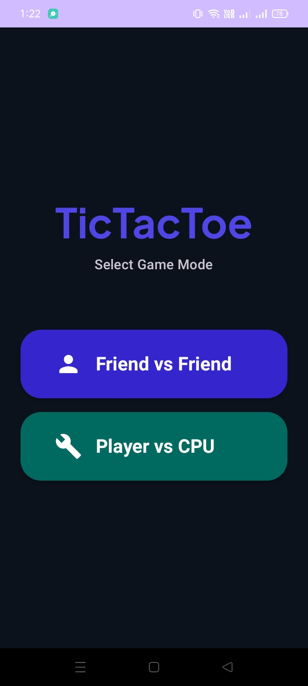
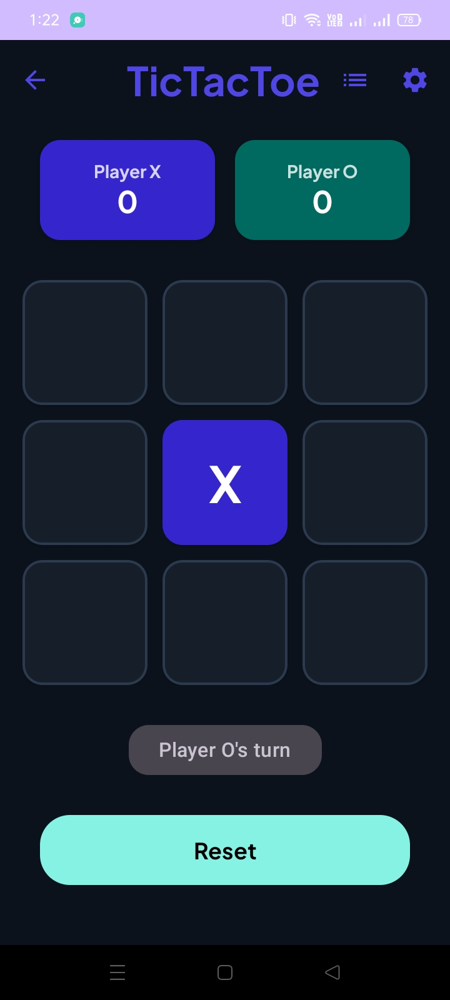
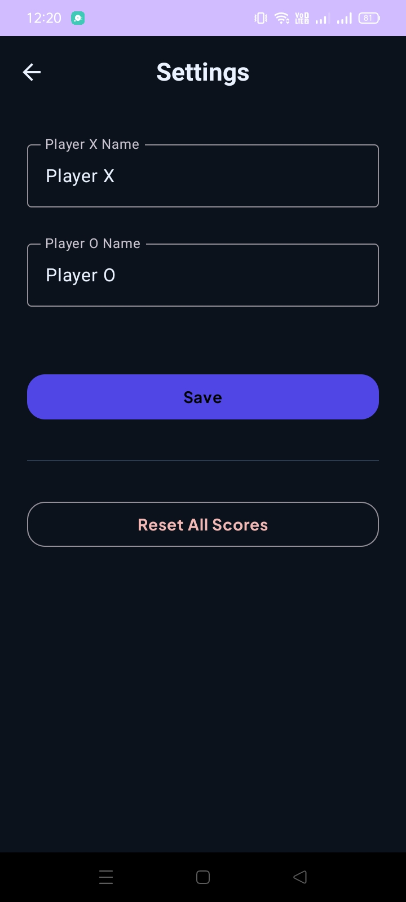

# Modern Tic-Tac-Toe Android App

A premium, feature-rich Tic-Tac-Toe application built with modern Android development practices. This project showcases a sleek "Midnight Tech" aesthetic with glassmorphism elements, smooth animations, and a robust feature set.

<p align="center">
  
</p>

## ✨ Features

- **🎮 Dual Game Modes:**
  - **Player vs Player:** Challenge a friend locally on the same device.
  - **Player vs CPU:** Test your skills against an AI with 3 adjustable difficulty levels (Easy, Medium, Hard) featuring minimax integration.
- **⚙️ Deep Customization:**
  - Personalized player names for both X and O.
  - **Dark Mode Support:** Toggle between premium light and midnight dark themes.
  - Robust haptic feedback and custom sound effect controls (bypasses device touch-sound limitations).
- **📜 Match History:** Keep track of your past victories and draws with a detailed history log.
- **🏆 Premium UI/UX:**
  - Full-screen glassmorphic result overlays.
  - Modern typography using *Plus Jakarta Sans*.
  - Reactive UI built entirely with **Jetpack Compose**.
- **💾 Persistent Data:** All settings, scores, and history are saved securely using **Android DataStore**.

## 🛠️ Tech Stack

- **Language:** [Kotlin](https://kotlinlang.org/)
- **UI Framework:** [Jetpack Compose](https://developer.android.com/jetpack/compose)
- **Design System:** Material 3 with Custom Tokens
- **Local Persistence:** [Android DataStore (Preferences)](https://developer.android.com/topic/libraries/architecture/datastore)
- **Navigation:** [Compose Navigation](https://developer.android.com/jetpack/compose/navigation)
- **Architecture:** MVVM (Model-View-ViewModel)

## 🚀 Developer Setup & Environment

To set up the development environment and build the project from scratch, follow these steps:

### 1. Environment Requirements
- **JDK:** Java Development Kit 17
- **Android SDK:** API Level 34 (Upside Down Cake)
- **Build System:** Gradle 8.2

### 2. Clone & Setup
```bash
# Clone the repository
git clone https://github.com/JaleedAhmad/tictactoe-app.git
cd tictactoe-app

# Grant execution permissions to the Gradle wrapper
chmod +x gradlew
```

### 3. Build & Run Commands

| Goal | Command |
| :--- | :--- |
| **Clean Project** | `./gradlew clean` |
| **Build Debug APK** | `./gradlew assembleDebug` |
| **Run Unit Tests** | `./gradlew test` |
| **Install on Device** | `./gradlew installDebug` |

The generated APK will be located at:  
`app/build/outputs/apk/debug/app-debug.apk`

---

## 📸 Screenshots

<p align="center">
  
  
  
</p>

---

*Developed with ❤️ as a modern take on a classic game.*
